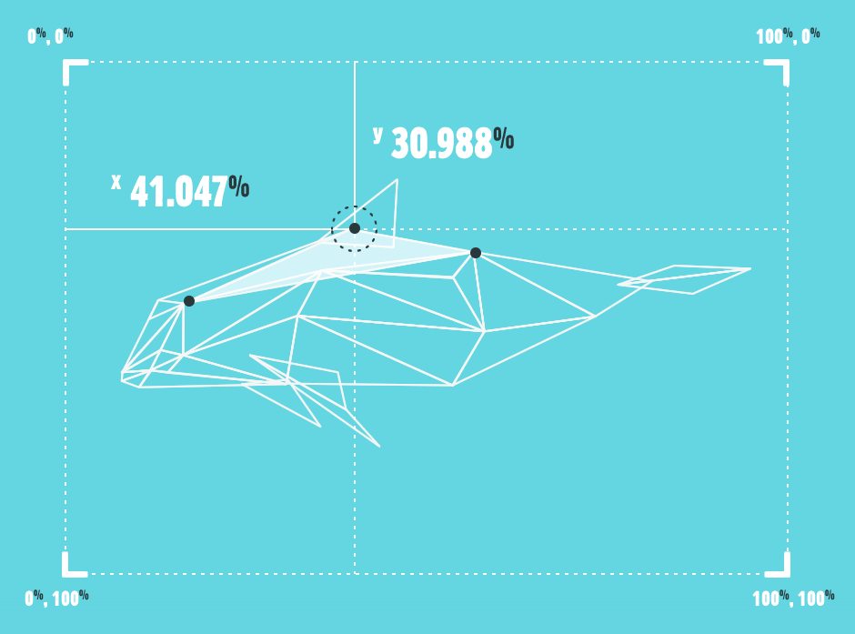

<p align="center">

</p>

<h1 align="center">Species <sup>in-piecese</sup></h1>

<p align="center">
Species In Pieces is an interactive exhibition turned study into 30 of the world’s most interesting but unfortunately endangered species — their survivals laying literally, in pieces.
</p>

## How it's made

<strong>Born out of tinkering with a simple property, this project is unabashedly part-digital experiment. The core technology used here is just good old CSS — no canvas or WebGL witchcraft.</strong>

Since hearing about <font color="#79BBB5">CSS polygons</font>, I've been a little surprised at the lack of furore around the technology, so I wanted to create something which not only worked as a project in itself, but also pushed this underused line of code as far as possible.

The shard-shifting capabilities work in webkit-browsers only, which of course is a limitation but at the same time, it <font color="#79BBB5">works on mobile</font> which are almost completely webkit-based. Firefox does support the clip-path property, but as an SVG referenced shape and thus, the coding for movement works in an entirely different manner. I wanted to focus purely on the CSS route.

Not heard of it? Here, take a line:

```css
-webkit-clip-path: polygon(40% 40%, 50% 60%, 60% 40%);
```

So, in essence — each shape is being morphed, moved and toyed with by a new set of co-ordinates, and as they are maintained as triangles throughout, this means 3 points, with CSS transitions to link up the movements. <font color="#79BBB5">No tricks or tools</font> have been used to get the illustrated results, code-wise or graphically. Point by point, shape by shape, each one has been handcrafted via a personally-created tracing JS function after illustration.

<p align="center">

</p>

## License

[MIT](./LICENSE) License © 2025 [siporg](https://github.com/siporg)
